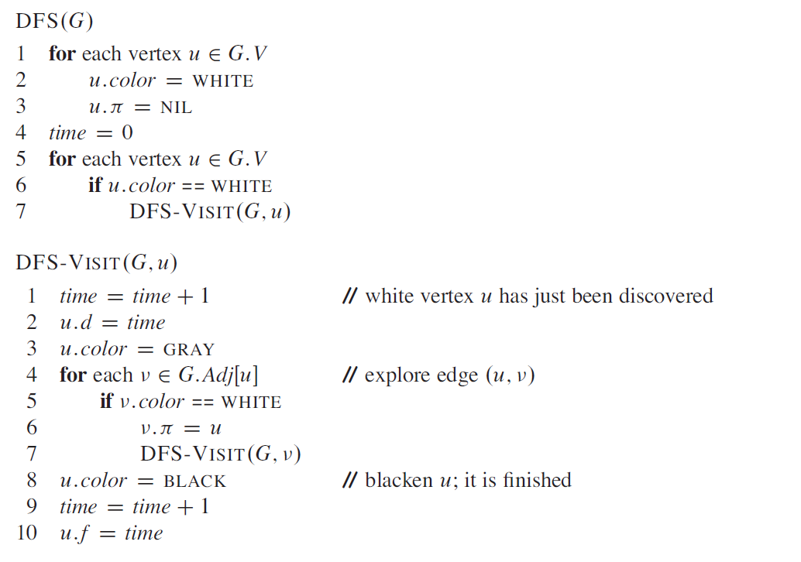
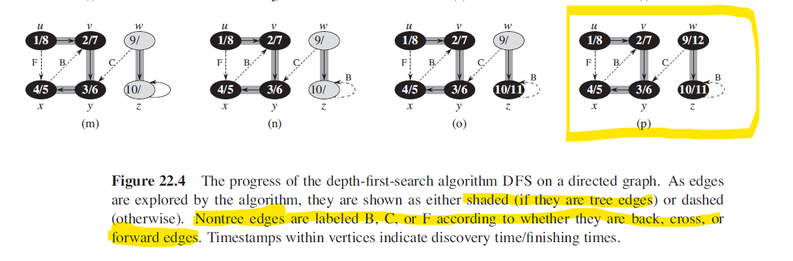
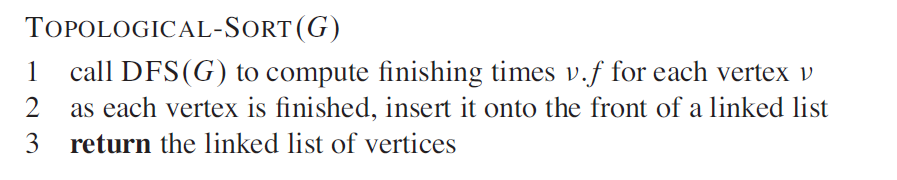

# Review of Trees and Graphs

## Elementary Graph Algorithms

### Representations of graphs
1. The adjacency-list representation of a graph G = (V,E) consists of an array Adj of |V| lists, one for each vertex in V. For each u ∈ V , the adjacency list Adj[u] contains all the vertices v such that there is an edge (u,v) ∈ E. The adjacency-list representation provides a compact way to represent sparse graphs, those for which |E| is much less than |V|^2. 
2. For the adjacency-matrix representation of a graph G = (V,E) we assume that the vertices are numbered 1, 2, ... , |V| in some arbitrary manner. Then the adjacency-matrix representation of a graph G consists of a |V| * |V| matrix A = (aij) such that aij = 1 if (i,j) ∈ E, otherwise 0. 

### Breadth-First Search
1. Given a graph G = (V,E) and a distinguished source vertex s, breadth-first search systematically explores the edges of G to “discover” every vertex that is reachable from s.
2.  
Each vertex is initially white, is grayed when it is discovered in the search, and is blackened when it is finished.
3. Breadth-First Search runs in time linear in the size of the adjacency-list representation of G, that's **O(V+E)**.
4. Application: Find Shortest Distances from a given source.

### Depth-First Search
1. Depth-First Search timestamps each vertex. Each vertex v has two timestamps: the first timestamp v.d records when v is first discovered (and grayed), and the second timestamp v.f records when the search finishes examining v’s adjacency list (and blackens v). These timestamps are integers between 1 and 2|V|.
2. For every vertex u with u.d < u.f, vertex u is white before time u.d, gray between u.d and u.f, and black thereafter.
3. 
4. The running time of DFS is Θ(V+E).   
5. Important Properties of DFS:
    1. Discovery and finishing times have parenthesis structure in DFS. Vertex v is a proper descendant of vertex u in the depth-first forest for a (directed or undirected) graph G if and only if **u.d < v.d < v.f < u.f**.
    2. Classification of edges:
        1. **Tree Edges**: Edge (u,v) is a tree edge if v was first discovered by exploring edge (u,v).
        2. **Back Edges**: edges (u,v) connecting a vertex u to an **ancestor** v in a depth-first tree. We consider self-loops, which may occur in directed graphs, to be back edges. 
        3. **Forward Edges**: nontree edges (u,v) connecting a vertex u to a **descendant** v in a depth-first tree.
        4. **Cross Edges**: all other edges. They can go between vertices in the same depth-first tree, as long as one vertex is not an ancestor of the other, or they can go between vertices in different depth-first trees.
    3. The key idea is that when we first explore an edge (u,v), the color of vertex v tells us something about the edge:
        1. WHITE indicates a tree edge
        2. Gray indicates a back edge
        3. Black indicates a forward or cross edge 
    4. In a DFS of an undirected graph G, every edge of G is either a tree edge or a back edge. Forward and cross edges never occur in a depth-first search of an undirected graph.     
    5. 

### Topological Sort
1. A topological sort of a dag (**directed acyclic graph**) G = (V,E) is a linear ordering of all its vertices such that if G contains an edge (u,v) then u appears before v in the ordering.
2. 
3. Time complexity of Topological Sort is Θ(V+E). 
4. A directed graph G is acyclic if and only if a DFS of G yields no back edges.

### Strongly Connected Components
1. A strongly connected component of a directed graph G = (V,E) is a maximal set of vertices C ⊆ V such that for every pair of vertices u and v in C, we have both u -> v and v -> u; that is, vertices u and v are reachable from each other.

### Articulation Points and Bridges
1. Let G = (V,E) be a connected, undirected graph. An articulation point of G is a vertex whose removal disconnects G. A bridge of G is an edge whose removal disconnects G.
2. We can determine articulation points and bridges using depth-first search. Let G' = (V, E') be a depth-first tree of G.
    1. The root of G' is an articulation point of G if and only if it has at least two children in G'.
    2. Given a non-root vertex of G' v, v is an articulation point of G if and only if v has a child s such that there is no back edge from s or any descendant of s to a proper ancestor of v.
    3. How to compute all articulation points in O(E) time?
    4. An edge of G is a bridge if and only if it does not lie on any simple cycle of G.
    5. How to compute all the bridges of G in O(E) time?

#### Tarjan’s algorithm (O(V+E))
1. In DFS tree, a vertex u is articulation point if one of the following two conditions is true.
    1. u is root of DFS tree and it has at least two children.
    2. u is not root of DFS tree and it has a child v such that no vertex in subtree rooted with v has a back edge to one of the ancestors (in DFS tree) of u.
2. In DFS traversal, we maintain:
    1. a parent array where parent[u] stores parent of vertex u
    2. a discovery time array disc[] where disc[u] store the discovery time of vertex u
    3. a array low[].  For every node u, we need to find out the earliest visited vertex (the vertex with minimum discovery time) that can be reached from subtree rooted with u. low[u] = min(disc[u], disc[w]) where w is an ancestor of u and there is a back edge from some descendant of u to w. 
3. [Algorithm details](https://www.geeksforgeeks.org/articulation-points-or-cut-vertices-in-a-graph/)  

## Minimum Spanning Trees
1. Given an undirected graph G = (V, E), for each edge (u,v) ∈ E, we have a weight w(u,v) specifying the cost to connect u and v. We wish to find an acyclic subset T ⊆ E that connects all of the vertices and whose total weight sum( w(u,v) ) is minimized. Since T connects all vertices and acyclic, it must form a tree, which we can spanning tree.
2. There are two common algorithms for solving the minimum spanning-tree problem:
    1. Kruskal's algorithm
    2. Prim's algorithm
3. Some basic definitions:
    1. A **cut** (S, V-S) of an undirected graph G = (V,S) is a partition of V. 
    2. We say that an edge (u,v) ∈ E **crosses** the cut (S, V-S) if one of its endpoints is in S and the other is in V - S.
    3. An edge is a **light edge** crossing a cut if its weight is the minimum of any edge crossing the cut.