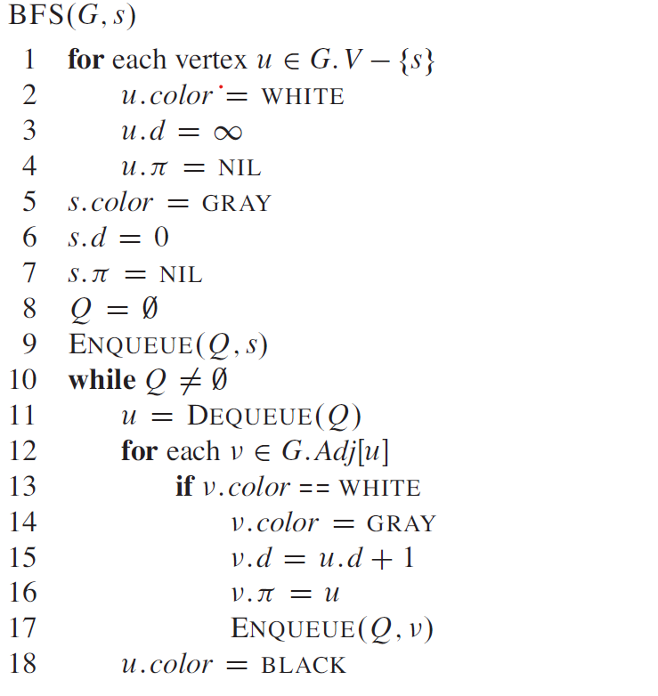

# Review of Trees and Graphs

## Elementary Graph Algorithms

### Representations of graphs
1. The adjacency-list representation of a graph G = (V,E) consists of an array Adj of |V| lists, one for each vertex in V. For each u ∈ V , the adjacency list Adj[u] contains all the vertices v such that there is an edge (u,v) ∈ E. The adjacency-list representation provides a compact way to represent sparse graphs, those for which |E| is much less than |V|^2. 
2. For the adjacency-matrix representation of a graph G = (V,E) we assume that the vertices are numbered 1, 2, ... , |V| in some arbitrary manner. Then the adjacency-matrix representation of a graph G consists of a |V| * |V| matrix A = (aij) such that aij = 1 if (i,j) ∈ E, otherwise 0. 

### Breadth-First Search
1. Given a graph G = (V,E) and a distinguished source vertex s, breadth-first search systematically explores the edges of G to “discover” every vertex that is reachable from s.
2. BFS Algorithm:
